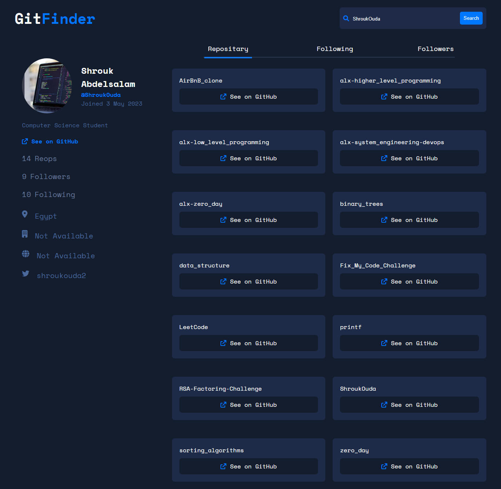
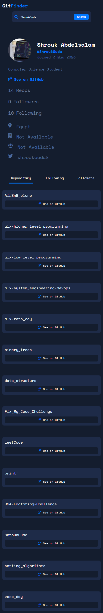

# GitFinder

## Table of contents

- [Overview](#overview)
  - [The challenge](#the-challenge)
  - [GitHub API Endpoints](#github-api-endpoints)
  - [Screenshot](#screenshot)
  - [Links](#links)
- [My process](#my-process)
  - [Built with](#built-with)
- [Author](#author)

## Overview

### The challenge

Users should be able to:

- View the optimal layout for the app depending on their device's screen size
- See hover states for all interactive elements on the page
- Search for GitHub users by their username
- See relevant user information based on their search

## GitHub API Endpoints

The following are the key GitHub API endpoints used in this project:

1. **User Profile**
   - **Endpoint:**  
     ```plaintext
     https://api.github.com/users/:username
     ```
   - **Example:**  
     ```plaintext
     https://api.github.com/users/ShroukOuda
     ```

2. **User Repositories**
   - **Endpoint:**  
     ```plaintext
     https://api.github.com/users/:username/repos
     ```
   - **Example:**  
     ```plaintext
     https://api.github.com/users/ShroukOuda/repos
     ```

3. **User Followers**
   - **Endpoint:**  
     ```plaintext
     https://api.github.com/users/:username/followers
     ```
   - **Example:**  
     ```plaintext
     https://api.github.com/users/ShroukOuda/followers
     ```

4. **User Following**
   - **Endpoint:**  
     ```plaintext
     https://api.github.com/users/:username/following
     ```
   - **Example:**  
     ```plaintext
     https://api.github.com/users/ShroukOuda/following
     ```


### Screenshot

- Desktop:  
  
  
- Mobile:  
  

### Links

- Live Site URL: [Live Demo]()

## My process

### Built with

- Semantic HTML5 markup
- CSS3
- JavaScript
- Fetch API
- GitHub API


## Author
- Shrouk Ouda
